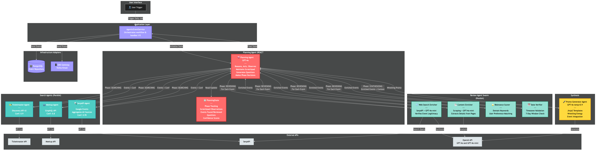
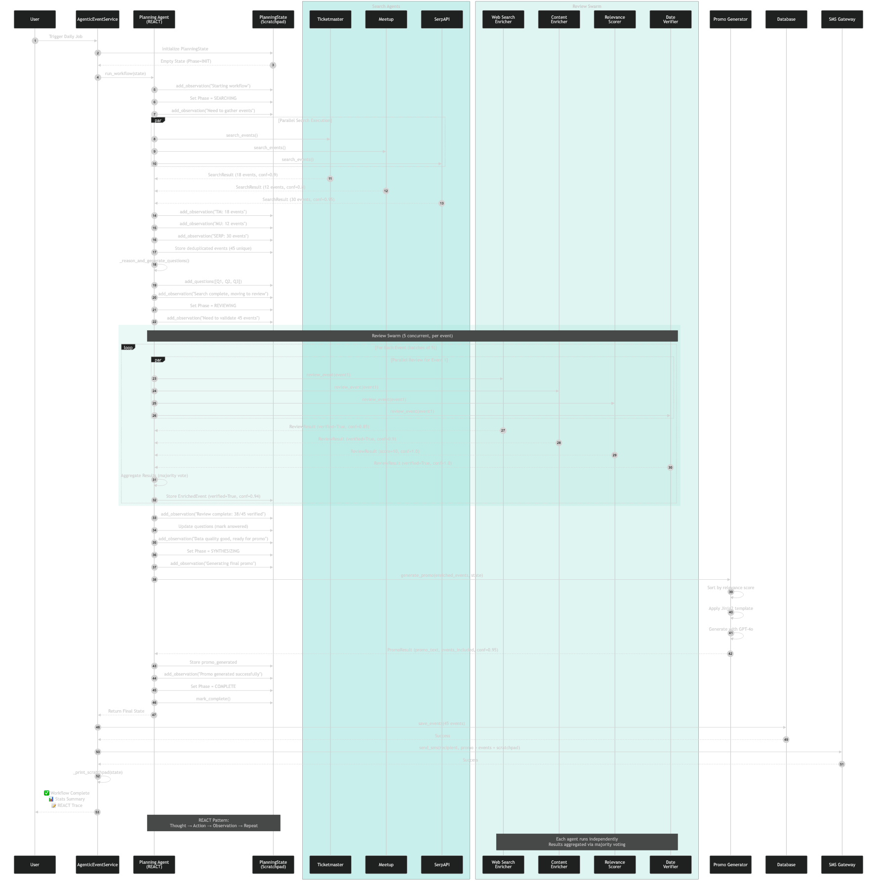

# Agentic System Diagrams

This directory contains comprehensive documentation and visual diagrams of the Houston Event Mania agentic system.

## 📚 Documentation Files

### [AGENTIC_SYSTEM_OVERVIEW.md](./AGENTIC_SYSTEM_OVERVIEW.md)
Complete technical documentation covering:
- All system components and their responsibilities
- Domain models and data structures
- SOTA patterns implemented (REACT, Chain-of-Thought, etc.)
- Architecture principles (Hexagonal, DDD, Ports & Adapters)
- Configuration and testing strategies
- Performance characteristics
- Future enhancements

## 🎨 Visual Diagrams

### 1. Architecture Diagram

**File**: [architecture_diagram.png](./architecture_diagram.png)

Shows the complete system architecture including:
- **Planning Agent** (REACT Orchestrator) - The brain that coordinates everything
- **Search Agents** (Parallel) - Ticketmaster, Meetup, SerpAPI
- **Review Agent Swarm** (Parallel) - Web Search Enricher, Content Enricher, Relevance Scorer, Date Verifier
- **Promo Generator Agent** - Wrestling promo synthesis
- **Infrastructure** - PostgreSQL, SMS Gateway
- **External APIs** - All third-party integrations

**Key Features**:
- Color-coded agent types
- Shows parallel execution paths
- Displays data flow between components
- Includes confidence scores
- Shows API integrations



---

### 2. Process Flow Diagram

**File**: [process_flow_diagram.png](./process_flow_diagram.png)

Shows the complete workflow execution sequence:
1. **User Trigger** → Service initialization
2. **INITIALIZING Phase** → State setup
3. **SEARCHING Phase** → Parallel search agent execution
4. **REVIEWING Phase** → Review swarm with majority voting
5. **SYNTHESIZING Phase** → Promo generation
6. **COMPLETE Phase** → Save to DB, send SMS

**Key Features**:
- Step-by-step sequence with numbering
- Shows parallel execution blocks
- Displays REACT observations being added to scratchpad
- Includes timing and confidence flow
- Shows aggregation logic (deduplication, majority voting)



---

## 🔧 Source Files

### Mermaid Diagram Source
- [architecture_diagram.mmd](./architecture_diagram.mmd) - Architecture diagram source
- [process_flow_diagram.mmd](./process_flow_diagram.mmd) - Process flow diagram source

These `.mmd` files can be edited and regenerated using the Mermaid CLI:

```bash
# Regenerate architecture diagram
mmdc -i architecture_diagram.mmd -o architecture_diagram.png -t dark -b transparent -w 2400 -H 1800

# Regenerate process flow diagram
mmdc -i process_flow_diagram.mmd -o process_flow_diagram.png -t dark -b transparent -w 1800 -H 2800
```

Or view/edit them online at: https://mermaid.live/

---

## 📖 Quick System Summary

### The Agentic System at a Glance

**Pattern**: REACT (Reasoning + Acting)
- **R**eason: Agent thinks about what to do next
- **A**ct: Takes action using tools or other agents
- **C**heck: Observes results
- **T**rack: Updates scratchpad with observations

**Execution Flow**:
```
Planning Agent
    ↓
Search Phase (Parallel)
    → Ticketmaster + Meetup + SerpAPI (simultaneous)
    ↓
Review Phase (Parallel Swarm)
    → 4 agents × N events (concurrent with limits)
    → Majority voting for verification
    ↓
Synthesis Phase
    → Promo Generator (GPT-4o with templates)
    ↓
Complete
    → Save to DB + Send SMS
```

**Key Benefits**:
- ⚡ **Fast**: Parallel execution (10-15s total)
- 🔍 **Transparent**: Complete REACT trace in scratchpad
- 🎯 **Accurate**: Multi-agent validation with confidence scores
- 🛡️ **Resilient**: Graceful degradation if agents fail
- 🔧 **Extensible**: Easy to add new agents

---

## 🎭 Agent Types

### Planning Agent (1)
- **Role**: Orchestrator/Conductor
- **Tech**: PydanticAI + GPT-4o
- **Pattern**: REACT loop

### Search Agents (3)
- **Role**: Data collectors
- **Execution**: Parallel
- **Sources**: Ticketmaster, Meetup, Google Events

### Review Agents (4)
- **Role**: Validators & enrichers
- **Execution**: Parallel swarm (5 concurrent)
- **Functions**: 
  - Web search verification
  - Content scraping & enrichment
  - Relevance scoring
  - Date validation

### Promo Agent (1)
- **Role**: Synthesizer
- **Tech**: PydanticAI + GPT-4o (temp=0.9)
- **Output**: Wrestling promo + event listing

---

## 🔗 Related Documentation

- [AGENTIC_ARCHITECTURE.md](./AGENTIC_ARCHITECTURE.md) - Original architecture explanation
- [AGENTIC_USAGE_GUIDE.md](./AGENTIC_USAGE_GUIDE.md) - How to run and use the system
- [DEPLOYMENT_GUIDE.md](./DEPLOYMENT_GUIDE.md) - Production deployment
- [SERPAPI_SETUP.md](./SERPAPI_SETUP.md) - SerpAPI configuration

---

## 🧪 Testing

The agentic system has comprehensive tests:

```bash
# All agentic tests
pytest tests/unit/agents tests/contract/agents tests/integration/agents

# By type
pytest tests/unit/agents -m unit           # Fast unit tests
pytest tests/contract/agents -m contract   # Port conformance
pytest tests/integration/agents -m integration  # Full workflow
```

---

## 🚀 Running the System

```bash
# With agentic system (recommended)
uv run python -m app.workers.run_daily_job --agentic

# Original system (for comparison)
uv run python -m app.workers.run_daily_job
```

---

## 📊 Example Output

```
🤖 STARTING AGENTIC EVENT WORKFLOW
================================================================================

=============================================================
ITERATION 1: Phase = initializing
=============================================================

...

📝 PLANNING AGENT SCRATCHPAD (REACT TRACE)
================================================================================

[1] PlanningAgent @ 09:15:32
    💭 Thought: Starting workflow. First step: search for events.
    🎯 Action: transition_to_search
    👁️  Observation: Moving to SEARCHING phase
    📊 Confidence: 1.00

[2] SearchAgent:SerpAPI @ 09:15:35
    💭 Thought: Searching SerpAPI (Google Events)
    🎯 Action: search_events
    👁️  Observation: Found 30 events in 2.8s
    📊 Confidence: 0.95

...

✅ AGENTIC WORKFLOW COMPLETE
================================================================================
📊 Stats:
  - Events found: 45
  - Events reviewed: 45
  - Search sources: SerpAPI, Ticketmaster, Meetup
  - Questions raised: 3
  - Observations logged: 12
  - Verified events: 38/45
  - Avg confidence: 0.87
================================================================================
```

---

## 🎯 Design Principles

1. **Hexagonal Architecture**: Domain at the core, ports define interfaces, adapters implement them
2. **REACT Pattern**: Transparent reasoning and decision-making
3. **Parallel Execution**: Maximum speed through concurrent agent operations
4. **Confidence Scoring**: Every decision has a confidence level
5. **Graceful Degradation**: System continues even if agents fail
6. **Observability**: Complete trace of all actions and reasoning

---

**For more details, see [AGENTIC_SYSTEM_OVERVIEW.md](./AGENTIC_SYSTEM_OVERVIEW.md)**

