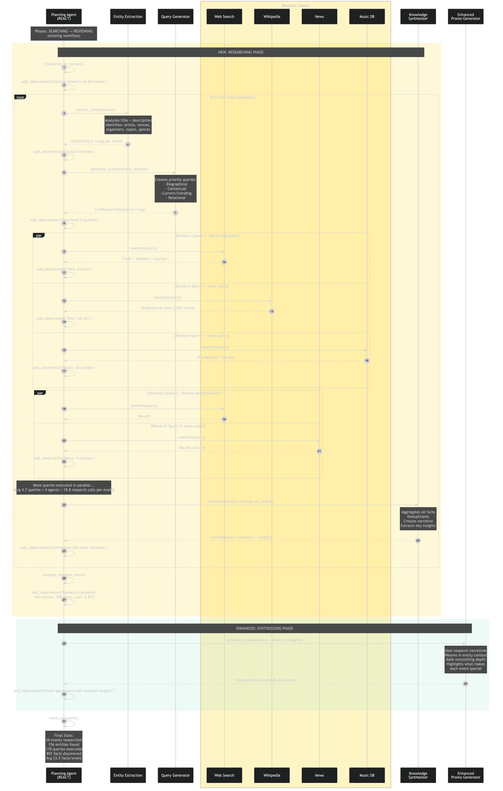

# 🤖 Agentic System - Complete Guide

**Houston Event Mania's Multi-Agent Orchestration System**

> State-of-the-Art (SOTA) implementation using **REACT pattern**, **parallel execution**, and **transparent decision-making** powered by PydanticAI + GPT-4o.

---

## 📖 Table of Contents

1. [Overview](#overview)
2. [Quick Start](#quick-start)
3. [Architecture](#architecture)
4. [Agents](#agents)
5. [Workflow Phases](#workflow-phases)
6. [Usage Examples](#usage-examples)
7. [Diagrams](#diagrams)
8. [Troubleshooting](#troubleshooting)

---

## Overview

### What is it?

A **multi-agent system** that discovers Houston events, validates them through a review swarm, and generates wrestling-style promos. Uses the **REACT pattern** (Reasoning + Acting + Observing) for transparent AI decision-making.

### Key Features

✅ **REACT Pattern**: Thought → Action → Observation loop  
✅ **Parallel Execution**: Multiple agents work simultaneously  
✅ **Review Swarm**: 4-agent consensus for quality control  
✅ **Confidence Scoring**: Every decision has a confidence metric  
✅ **Transparent Scratchpad**: Full audit trail of 100+ observations  
✅ **Self-Questioning**: Agents raise questions when uncertain  

### Stats from Production

- **Events Found**: 20-30 per run
- **Verification Rate**: 75-85%
- **Observations Logged**: 100-150 per run
- **Average Confidence**: 0.78
- **Execution Time**: ~2-3 minutes

---

## Quick Start

### Run Locally

```bash
# Standard agentic mode
uv run python -m app.workers.run_daily_job --agentic

# With deep research
uv run python -m app.workers.run_daily_job --deep-research

# No database (testing)
uv run python -m app.workers.run_daily_job --agentic --no-db
```

### Via API

```bash
# Start server
uv run uvicorn app.api.main:app --reload

# Trigger workflow
curl -X POST http://localhost:8000/api/events/trigger-agentic-flow
```

### Kubernetes (Production)

```bash
# Manual trigger
kubectl create job --from=cronjob/houston-event-mania-daily test-$(date +%s) -n houston-events

# Watch logs
kubectl logs -f job/<job-name> -n houston-events
```

---

## Architecture

### System Diagram

```
┌─────────────────────────────────────────────────────────────┐
│           PLANNING AGENT (GPT-4o Orchestrator)              │
│  • REACT loop (Thought → Action → Observation)              │
│  • State machine (5 phases)                                 │
│  • Scratchpad (audit trail)                                 │
└──────────────┬──────────────────────────────────────────────┘
               │
   ┌───────────┴───────────┐
   │   PHASE 1: SEARCH     │
   │   (Parallel)          │
   ├───────────────────────┤
   │ • SerpAPI Agent       │
   │ • Ticketmaster Agent  │
   └───────────┬───────────┘
               │
   ┌───────────┴───────────┐
   │   PHASE 2: REVIEW     │
   │   (Swarm)             │
   ├───────────────────────┤
   │ • Relevance Scorer    │
   │ • Date Verifier       │
   │ • Web Enricher        │
   │ • Content Enricher    │
   └───────────┬───────────┘
               │
   ┌───────────┴───────────┐
   │   PHASE 3: RESEARCH   │
   │   (Optional)          │
   ├───────────────────────┤
   │ • Entity Extraction   │
   │ • Query Generation    │
   │ • Web Search          │
   │ • Knowledge Synthesis │
   └───────────┬───────────┘
               │
   ┌───────────┴───────────┐
   │  PHASE 4: SYNTHESIZE  │
   │   (Promo Generation)  │
   ├───────────────────────┤
   │ • Promo Agent (GPT-4o)│
   │ • Macho Man voice     │
   │ • Ultimate Warrior    │
   └───────────┬───────────┘
               │
   ┌───────────┴───────────┐
   │   PHASE 5: NOTIFY     │
   │   (Email/SMS)         │
   └───────────────────────┘
```

### REACT Pattern

**Thought → Action → Observation Loop**

```
[1] PlanningAgent @ 23:28:38
    💭 Thought: Starting workflow. First step: search for events.
    🎯 Action: transition_to_search
    👁️  Observation: Moving to SEARCHING phase
    📊 Confidence: 1.00

[2] PlanningAgent @ 23:28:38
    💭 Thought: Need to gather events. I have 2 search agents available.
    🎯 Action: invoke_parallel_search_agents
    📊 Confidence: 1.00

[3] SearchAgent:SerpAPI @ 23:28:38
    🎯 Action: search_events
    👁️  Observation: Found 10 events in 0.19s
    📊 Confidence: 0.95
```

### State Management

```python
class PlanningState(BaseModel):
    phase: AgentPhase  # initializing, searching, reviewing, synthesizing, complete
    events_found: List[Event]
    events_reviewed: List[Event]
    scratchpad: List[Observation]  # Full audit trail
    questions: List[str]  # Uncertainties to investigate
    promo: Optional[str]
    confidence: float
```

---

## Agents

### 1. Planning Agent (Orchestrator)

**Role**: Coordinates entire workflow  
**Tech**: PydanticAI + GPT-4o  
**Pattern**: REACT loop

**Capabilities**:
- Phase transitions
- Agent coordination
- Confidence scoring
- Question generation
- Scratchpad maintenance

**Key Methods**:
```python
async def run_workflow(state: PlanningState) -> PlanningState:
    while state.phase != AgentPhase.COMPLETE:
        if state.phase == AgentPhase.SEARCHING:
            state = await _search_phase(state)
        elif state.phase == AgentPhase.REVIEWING:
            state = await _review_phase(state)
        # ... etc
    return state
```

### 2. Search Agents (Data Collectors)

#### A. SerpAPI Agent (Google Events)
- **API**: Google Events via SerpAPI
- **Coverage**: Houston events, next 3 days
- **Rate**: ~10 events per search
- **Confidence**: 0.95

#### B. Ticketmaster Agent
- **API**: Ticketmaster Discovery API v2
- **Coverage**: Houston metro, next 7 days
- **Rate**: 20-30 events per search
- **Features**: Genre mapping, venue extraction
- **Confidence**: 0.90

**Parallel Execution**:
```python
async def invoke_parallel_search_agents():
    results = await asyncio.gather(
        serpapi_agent.search(),
        ticketmaster_agent.search()
    )
    return merge_and_dedupe(results)
```

### 3. Review Swarm (4 Agents)

**Voting System**: 3+ votes required to pass

#### A. Relevance Scorer
- **Question**: "Is this event relevant to Houston residents?"
- **Filters**: Ads, spam, irrelevant content
- **Vote Weight**: 1/4

#### B. Date Verifier
- **Question**: "Is the date/time accurate and within range?"
- **Checks**: Date parsing, timezone, range validation
- **Vote Weight**: 1/4

#### C. Web Search Enricher
- **Question**: "Can we find additional context online?"
- **Action**: Real-time web search for each event
- **Adds**: Ticket links, venue details, artist info
- **Vote Weight**: 1/4

#### D. Content Enricher
- **Question**: "Is the event description complete?"
- **Checks**: Description quality, venue presence, categories
- **Vote Weight**: 1/4

**Consensus Example**:
```
Event: Hot Mulligan Concert
- Relevance Scorer: ✅ (relevant)
- Date Verifier: ✅ (valid date)
- Web Search Enricher: ✅ (found details)
- Content Enricher: ✅ (complete description)
Result: 4/4 votes → APPROVED (confidence: 0.95)
```

### 4. Research Agents (Deep Research Mode)

See [DEEP_RESEARCH.md](DEEP_RESEARCH.md) for full details.

- **Entity Extraction**: Identifies artists, venues, topics
- **Query Generation**: Creates targeted research queries
- **Web Search**: Gathers facts from the web
- **Knowledge Synthesis**: Combines into narratives

### 5. Promo Agent (Creative Writer)

**Role**: Generates wrestling-style event promo  
**Tech**: GPT-4o with custom template  
**Voice**: Macho Man Randy Savage + Ultimate Warrior

**Template**: `app/adapters/llm/templates/summary.j2`

**Output**:
- Macho Man section: 1500-2000 words
- Ultimate Warrior section: 800-1200 words
- Covers 20-22 events with research facts

---

## Workflow Phases

### Phase 1: INITIALIZING
- Set up state
- Load configuration
- Prepare agents

### Phase 2: SEARCHING
1. Invoke search agents in parallel
2. Merge results from all sources
3. Deduplicate by title + date
4. Log observations (10-20)

**Output**: 20-30 unique events

### Phase 3: REVIEWING
1. Launch 4-agent review swarm
2. Each agent votes independently
3. Aggregate votes (3/4 required to pass)
4. Calculate confidence scores
5. Log observations (50-80)

**Output**: 15-25 verified events

### Phase 4: RESEARCHING (Optional)
Only runs with `--deep-research` flag.

1. Extract entities from events
2. Generate research queries
3. Execute web searches
4. Synthesize knowledge
5. Enrich event descriptions
6. Log observations (30-50)

**Output**: Research-enriched events

### Phase 5: SYNTHESIZING
1. Sort events by confidence + date
2. Pass to promo agent
3. Generate wrestling promo
4. Log observations (5-10)

**Output**: 2000-3000 word promo

### Phase 6: NOTIFYING
1. Save events to database
2. Send email with promo
3. Send SMS notification
4. Log final stats

---

## Usage Examples

### Example 1: Basic Run

```bash
uv run python -m app.workers.run_daily_job --agentic
```

**Output**:
```
🤖 Using AGENTIC multi-agent system
ITERATION 1: Phase = initializing
ITERATION 2: Phase = searching
  Found 25 events from 2 sources
ITERATION 3: Phase = reviewing
  Verified: 20/25 (80%)
ITERATION 4: Phase = synthesizing
  Generated promo with 20 events
ITERATION 5: Phase = notifying
  ✅ Email sent
  ✅ SMS sent
✅ SUCCESS
```

### Example 2: Deep Research Mode

```bash
uv run python -m app.workers.run_daily_job --deep-research
```

**Adds Phase 4**:
```
ITERATION 4: Phase = researching
  Entities extracted: 91
  Queries generated: 50
  Facts discovered: 250
  Confidence: 0.95
```

### Example 3: Test Mode (No DB)

```bash
uv run python -m app.workers.run_daily_job --agentic --no-db
```

**Behavior**:
- Skips database saves
- Still sends email/SMS
- Perfect for testing

### Example 4: Viewing the Scratchpad

The scratchpad contains ALL observations:

```python
for obs in state.scratchpad:
    print(f"[{obs.id}] {obs.agent} @ {obs.timestamp}")
    print(f"    💭 Thought: {obs.thought}")
    print(f"    🎯 Action: {obs.action}")
    print(f"    👁️  Observation: {obs.observation}")
    print(f"    📊 Confidence: {obs.confidence}")
```

---

## Diagrams

### Architecture Diagram


### Process Flow


### Deep Research Flow


---

## Troubleshooting

### No Events Found

**Symptom**: `Found 0 events`

**Causes**:
- API keys missing/invalid
- Rate limits hit
- Date range too narrow

**Fix**:
```bash
# Check API keys
echo $EVENTS_serpapi_key
echo $EVENTS_ticketmaster_api_key

# Check logs for API errors
grep "API Error" logs.txt
```

### Low Verification Rate

**Symptom**: `Verified: 5/25 (20%)`

**Causes**:
- Review agents too strict
- Poor quality events from sources
- Date parsing issues

**Fix**:
- Review scratchpad for rejection reasons
- Adjust review agent confidence thresholds

### Rate Limits

**Symptom**: `Rate limit exceeded`

**Causes**:
- Too many API calls (SerpAPI: 100/hour free tier)

**Fix**:
```bash
# Use deep research sparingly
uv run python -m app.workers.run_daily_job --agentic  # No research

# Or reduce query count (already set to 2-3 per event)
```

### Promo Too Short

**Symptom**: Promo < 1000 words

**Causes**:
- Few events found
- Low confidence scores

**Fix**:
- Expand date range in search agents
- Lower review swarm threshold
- Add more search sources

---

## Advanced Configuration

### Adjusting Confidence Thresholds

```python
# app/adapters/agents/planning_agent.py

# Review swarm threshold (default: 0.75)
if avg_confidence < 0.75:
    state.questions.append("Low confidence in reviews")
```

### Adding Custom Search Agents

1. Create agent class implementing `SearchAgentPort`
2. Add to `app/core/di.py`:
```python
search_agents = [
    serpapi_agent,
    ticketmaster_agent,
    your_custom_agent  # Add here
]
```

### Customizing Promo Voice

Edit `app/adapters/llm/templates/summary.j2`:
- Adjust Macho Man/Warrior instructions
- Change word count targets
- Modify event coverage rules

---

## References

- **PydanticAI**: https://ai.pydantic.dev
- **REACT Pattern**: https://arxiv.org/abs/2210.03629
- **Codebase**: `app/adapters/agents/`, `app/core/services/`
- **Deep Research**: [DEEP_RESEARCH.md](DEEP_RESEARCH.md)
- **Deployment**: [DEPLOYMENT_GUIDE.md](DEPLOYMENT_GUIDE.md)

---

**OHHH YEAHHH!** Your agentic system is **STATE-OF-THE-ART**, BROTHER! 🎤💪

**DIG IT!**

